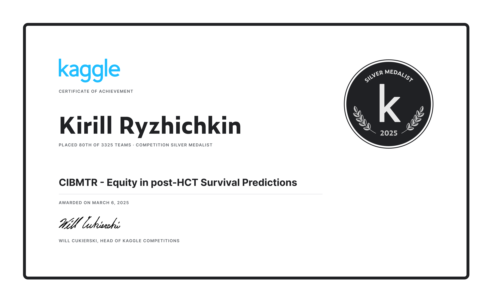

# CIBMTR - Equity in post-HCT Survival Predictions (Kaggle Silver Medal)

## Description

> Improving survival predictions for allogeneic HCT patients is a vital healthcare challenge. Current predictive models often fall short in addressing disparities related to socioeconomic status, race, and geography. Addressing these gaps is crucial for enhancing patient care, optimizing resource utilization, and rebuilding trust in the healthcare system. This competition aims to encourage participants to advance predictive modeling by ensuring that survival predictions are both precise and fair for patients across diverse groups. By using synthetic data—which mirrors real-world situations while protecting patient privacy—participants can build and improve models that more effectively consider diverse backgrounds and conditions. You’re challenged to develop advanced predictive models for allogeneic HCT that enhance both accuracy and fairness in survival predictions. The goal is to address disparities by bridging diverse data sources, refining algorithms, and reducing biases to ensure equitable outcomes for patients across diverse race groups. Your work will help create a more just and effective healthcare environment, ensuring every patient receives the care they deserve.

## Diagram of the whole solution

.png?generation=1741248409176452&alt=media>)

## First Part

1. Based on Chris Deotte's great [notebook](https://www.kaggle.com/code/cdeotte/gpu-lightgbm-baseline-cv-681-lb-685)
2. No feature engeneering
3. 4 types of targets: KMF, NAF, BFHF, COX
4. Creating a target with KFold
5. Hyperparameter search with Optuna for each model

## Second Part

1. Some feature engeneering
2. 4 types of targets: KMF, NAF, BFHF, COX
3. Creating a target with KFold
4. No hyperparameter search

### About FE

- HLA recalculation ([from here](https://www.kaggle.com/code/albansteff/cibmtr-eda-ensemble-model-recalculate-hla))

```python
def recalc(df):
    df['hla_nmdp_6'] = (
        df['hla_match_a_low'].fillna(0) +
        df['hla_match_b_low'].fillna(0) +
        df['hla_match_drb1_high'].fillna(0)
    )

    df['hla_low_res_6'] = (
        df['hla_match_a_low'].fillna(0) +
        df['hla_match_b_low'].fillna(0) +
        df['hla_match_drb1_low'].fillna(0)
    )

    df['hla_high_res_6'] = (
        df['hla_match_a_high'].fillna(0) +
        df['hla_match_b_high'].fillna(0) +
        df['hla_match_drb1_high'].fillna(0)
    )

    df['hla_low_res_8'] = (
        df['hla_match_a_low'].fillna(0) +
        df['hla_match_b_low'].fillna(0) +
        df['hla_match_c_low'].fillna(0) +
        df['hla_match_drb1_low'].fillna(0)
    )

    df['hla_high_res_8'] = (
        df['hla_match_a_high'].fillna(0) +
        df['hla_match_b_high'].fillna(0) +
        df['hla_match_c_high'].fillna(0) +
        df['hla_match_drb1_high'].fillna(0)
    )

    df['hla_low_res_10'] = (
        df['hla_match_a_low'].fillna(0) +
        df['hla_match_b_low'].fillna(0) +
        df['hla_match_c_low'].fillna(0) +
        df['hla_match_drb1_low'].fillna(0) +
        df['hla_match_dqb1_low'].fillna(0)
    )

    df['hla_high_res_10'] = (
        df['hla_match_a_high'].fillna(0) +
        df['hla_match_b_high'].fillna(0) +
        df['hla_match_c_high'].fillna(0) +
        df['hla_match_drb1_high'].fillna(0) +
        df['hla_match_dqb1_high'].fillna(0)
    )

    return df
```

- Encoding categorical features using KMF

```python
import pandas as pd
import numpy as np
from lifelines import KaplanMeierFitter
import matplotlib.pyplot as plt
import seaborn as sns
import json

def plot_feature_survival_curves(
    df, feature, efs_time='efs_time', efs='efs', risk_score='risk_score',
    n_groups=3, continuous_split='quantile'
):
    if PLOT_CURVES:
        plt.figure(figsize=(10, 6))

    kmf = KaplanMeierFitter()

    unique_values = pd.Series(df[feature].unique())

    if df[feature].dtype in ['object', 'category', 'str', 'categorical'] or len(unique_values) <= n_groups:
        groups = df[feature]
        labels = unique_values.sort_values()
        label_names = labels
    else:
        if continuous_split == 'quantile':
            groups = pd.qcut(df[feature], n_groups, duplicates='drop')
            labels = sorted(groups.unique())
            label_names = [f"{feature} [{interval.left:.2f}-{interval.right:.2f}]" for interval in labels]
        else:
            groups = pd.cut(df[feature], n_groups)
            labels = sorted(groups.unique())
            label_names = [f"{feature} [{interval.left:.2f}-{interval.right:.2f}]" for interval in labels]

    stats = {}
    for i, (group, label_name) in enumerate(zip(labels, label_names)):
        if isinstance(groups, pd.Series) and groups.dtype.name == 'category':
            mask = (groups == group)
        else:
            mask = (df[feature] == group)

        group_data = df[mask]

        if len(group_data) > 0:
            n = len(group_data)
            kmf.fit(
                group_data[efs_time],
                group_data[efs],
                label=f'{label_name} (n={n})'
            )

            survival_values = kmf.survival_function_.iloc[:, 0].values
            mean_survival = np.mean(survival_values)
            std_survival = np.std(survival_values)

            stats[label_name] = {
                'n': n,
                'mean': np.mean(survival_values),
                'std': np.std(survival_values),
                'median': np.median(survival_values),
                'iqr': np.percentile(survival_values, 75) - np.percentile(survival_values, 25),
                'range': np.max(survival_values) - np.min(survival_values),
                'cv': np.std(survival_values) / np.mean(survival_values) if np.mean(survival_values) != 0 else np.nan,
                'q1': np.percentile(survival_values, 25),
                'q3': np.percentile(survival_values, 75),
                'skewness': (3 * (np.mean(survival_values) - np.median(survival_values))) / np.std(survival_values) if np.std(survival_values) != 0 else np.nan
            }

            if PLOT_CURVES:
                kmf.plot()

    if PLOT_CURVES:
        plt.title(f'curves for group {feature}')
        plt.xlabel('time')
        plt.ylabel('proba')

    # print(json.dumps(stats, indent=2))

    from lifelines.statistics import logrank_test
    if len(labels) == 2:
        group1 = df[groups == labels[0]]
        group2 = df[groups == labels[1]]

        if len(group1) > 0 and len(group2) > 0:
            results = logrank_test(
                group1[efs_time], group2[efs_time],
                group1[efs], group2[efs]
            )
            if PLOT_CURVES:
                plt.text(0.05, 0.05, f'Log-rank p-value: {results.p_value:.3f}',
                        transform=plt.gca().transAxes)

    if PLOT_CURVES:
        plt.grid(True)
        plt.show()

    return stats


new_train = train.copy()
new_test = test.copy()

CAT_FEATURES = []

for col in new_train.columns:
    if new_train[col].nunique() < 100 and col != 'efs':
        CAT_FEATURES.append(col)
        new_train[col] = new_train[col].astype(str)
        new_train[col] = new_train[col].fillna('NAN')
        new_test[col] = new_test[col].astype(str)
        new_test[col] = new_test[col].fillna('NAN')

kf = KFold(n_splits=FOLDS, shuffle=True, random_state=52)

new_features_train = pd.DataFrame(index=new_train.index)
new_features_test = pd.DataFrame(index=new_test.index)

for fold, (train_idx, val_idx) in enumerate(kf.split(new_train)):
    print(f"Processing fold {fold + 1}")

    fold_train = new_train.iloc[train_idx]
    fold_val = new_train.iloc[val_idx]

    mappings = {}
    for col in CAT_FEATURES:
        mapping = plot_feature_survival_curves(fold_train, col)
        mappings[col] = mapping

    for feature, values in mappings.items():
        for stat in next(iter(values.values())).keys():
            col_name = f"{feature}_{stat}"

            new_features_train.loc[val_idx, col_name] = fold_val[feature].map(
                lambda x: values[x][stat] if x in values else None
            )

            test_predictions = new_test[feature].map(
                lambda x: values[x][stat] if x in values else None
            )
            if col_name not in new_features_test.columns:
                new_features_test[col_name] = test_predictions
            else:
                new_features_test[col_name] += test_predictions

new_features_test = new_features_test.div(FOLDS)

train = pd.concat([train, new_features_train], axis=1)
test = pd.concat([test, new_features_test], axis=1)

CAT_FEATURES  = []

for c in train.columns:
    if train[c].dtype == "object":
        CAT_FEATURES.append(c)
        train[c] = train[c].fillna("NAN")
        test[c] = test[c].fillna("NAN")
```

## Third Part

### Ranking NN Models

1. 2x LitNN w/ different seeds from [here](https://www.kaggle.com/code/dreamingtree/single-nn-with-pairwise-ranking-loss-0-689-lb)
2. TabM w/ the same loss

### Default NN Models

1. TabM w/ NAF & KMF targets
2. Models from Pytabkit: FTT, RealMLP, MLP_PRL, ResNet

No feature generation or hyperparameter search was performed for neural networks.

## Fourth Part

I also added a few public models to the ensemble:

1. @abdmental01 - catboost w/ KMF target
2. @i2nfinit3y - models from hill climbing ensemble
3. @ern711 - multitarget catboost
4. @dmtrrskv - models w/ Tweedie loss

## Fifth part

1. Used CMA-ES instead of TPE (gave a big increase in quality)
2. There is a chance of CV overfitting (only 10 folds OOF, I didn't use Nested CV)
3. There were 3 Optuna runs, then the predictions were averaged out

## Sixth part

Here I used the Event-Masking idea with XGB from public notebooks, it gave a small boost to CV and LB.

## What didn't work

- Calibration (isotonic regression)
- Extensive feature engeneering w/ feature selection
- Tuning blending weights for each race separately (led to severe CV overfitting)
- NNs w/ cox loss (from pycox, deepsurv, etc.)

## Certificate


